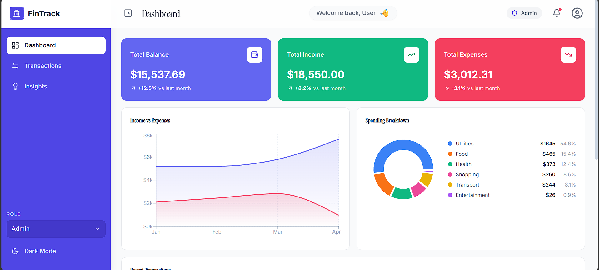

# FinTrack — Finance Dashboard



A clean, interactive finance dashboard built with **React** for tracking income, expenses, and financial activity. Designed as a frontend-only project with mock data, role-based UI simulation, and persistent state.

**Live Demo:** [zorvyn-assignment-teal.vercel.app](https://zorvyn-assignment-teal.vercel.app/) · **Repository:** [github.com/anjany06/zorvyn_assignment](https://github.com/anjany06/zorvyn_assignment)

---

## Overview

FinTrack is a single-page application that lets users view their financial summary, explore transactions, and understand spending patterns through interactive charts. It simulates role-based access where an Admin can add, edit, and delete transactions while a Viewer can only browse data.

The focus is on clean design, intuitive layout, and proper component architecture — not backend complexity.

---

## Features

### Dashboard
- Summary cards showing **Total Balance**, **Income**, and **Expenses** with trend indicators
- **Income vs Expenses** area chart (time-based visualization)
- **Spending Breakdown** donut chart by category (categorical visualization)
- Recent transactions list

### Transactions
- Full list with **date**, **description**, **category**, **amount**, and **type**
- **Search** across descriptions and categories
- **Filter** by type (income/expense) and category
- **Sort** by date or amount
- **CSV export** of filtered data
- **Add / Edit / Delete** transactions (admin only)
- **Confirm popup** before deleting

### Insights
- **Highest spending category** identification
- **Monthly comparison** bar chart
- **Savings rate** calculation
- **Category progress bars** with animated fills
- **Quick summary** stats grid

### Role-Based UI
No backend auth — just a frontend simulation:

| Action | Admin | Viewer |
|---|:---:|:---:|
| View dashboard & insights | ✅ | ✅ |
| Browse transactions | ✅ | ✅ |
| Add transaction | ✅ | ❌ |
| Edit transaction | ✅ | ❌ |
| Delete transaction | ✅ | ❌ |
| Export CSV | ✅ | ✅ |

Switch roles via the dropdown in the sidebar.

### Additional Features
- **Dark mode** toggle with persistence
- **LocalStorage** persistence for transactions, role, and theme
- **Responsive layout** — works on desktop, tablet, and mobile
- **Micro-animations** using Framer Motion for smooth transitions

---

## Tech Stack

| Technology | Purpose |
|---|---|
| React 18 | Component-based UI |
| React Router v6 | Client-side routing |
| Tailwind CSS 3 | Utility-first styling |
| Framer Motion | Entry animations & transitions |
| Recharts | Area charts, bar charts, pie charts |
| Lucide React | Icon set |
| Vite 6 | Dev server & build tool |

### Typography
- **Instrument Serif** — used for page headings and titles
- **Inter** — used for body text, labels, and data

---

## Project Structure

```
src/
├── components/
│   ├── dashboard/
│   │   ├── SummaryCards.jsx       # Balance, income, expense cards
│   │   ├── BalanceTrend.jsx       # Income vs expenses area chart
│   │   ├── SpendingBreakdown.jsx  # Category donut chart
│   │   └── RecentTransactions.jsx # Last 5 transactions
│   ├── insights/
│   │   ├── InsightCards.jsx       # Top spending, monthly change, savings
│   │   ├── MonthlyComparison.jsx  # Bar chart comparing months
│   │   ├── CategoryBreakdown.jsx  # Progress bars by category
│   │   └── QuickSummary.jsx       # Stats grid
│   ├── transactions/
│   │   ├── TransactionList.jsx    # Table with search, filter, sort
│   │   └── TransactionModal.jsx   # Add/edit form (shared modal)
│   ├── layout/
│   │   ├── Sidebar.jsx            # Nav, role switcher, theme toggle
│   │   └── Header.jsx             # Page title, role badge
│   └── ui/
│       └── ConfirmModal.jsx       # Delete confirmation popup
├── context/
│   └── AppContext.jsx             # Global state provider
├── hooks/
│   └── useInsights.js             # Derived insights from transactions
├── data/
│   └── mockData.js                # Static sample data
├── pages/
│   ├── Dashboard.jsx
│   ├── Transactions.jsx
│   └── Insights.jsx
├── App.jsx                        # Router + layout
├── main.jsx                       # Entry point
└── index.css                      # Tailwind + global styles
```

---

## Getting Started

### Prerequisites
- Node.js 18+ and npm

### Setup

```bash
git clone https://github.com/anjany06/zorvyn_assignment.git
cd zorvyn_assignment
npm install
npm run dev
```

Open [http://localhost:5173](http://localhost:5173) in your browser.

### Production Build

```bash
npm run build
npm run preview
```

---

## Approach

1. **Component-first architecture** — each visual section is its own component, grouped by feature (dashboard, transactions, insights, layout, ui).

2. **Simple state management** — used React Context API for global state (role, transactions, theme). No Redux or Zustand since the app size doesn't justify it. Filters and local UI state stay component-level with `useState`.

3. **LocalStorage for persistence** — transactions, role selection, and dark mode preference persist across browser sessions.

4. **Role simulation** — a simple context value (`admin` / `viewer`) controls what UI elements are rendered. No backend RBAC logic needed.

5. **Shared modal pattern** — the same `TransactionModal` component handles both adding and editing. When a transaction prop is passed, it pre-fills the form; otherwise it starts empty.

6. **Custom hook for insights** — `useInsights` derives all calculated data (totals, averages, top category, savings rate) from transactions using `useMemo`, shared across multiple insight components.

7. **Typography** — Instrument Serif for headings gives a polished, editorial feel while Inter keeps body text clean and readable.

8. **Light Framer Motion usage** — entry animations on cards and charts, animated filter panel toggle, progress bar fills. Kept subtle to not overwhelm.

---

## State Management

```
AppContext
├── role (admin | viewer)         → persisted in localStorage
├── transactions[]                → persisted in localStorage  
├── darkMode (boolean)            → persisted in localStorage
├── addTransaction(data)
├── updateTransaction(id, data)
└── deleteTransaction(id)
```

Component-level state handles: search query, active filters, sort order, modal visibility, and delete confirmation.

---

## Deployment

The project includes a `vercel.json` with SPA rewrites so React Router works on all paths.

**To deploy on Vercel:**
1. Push the repo to GitHub
2. Connect the repo on [vercel.com](https://vercel.com)
3. Vercel auto-detects Vite — just deploy

Or manually:
```bash
npm install -g vercel
vercel
```

---

## Edge Cases Handled

- Empty transaction list shows a friendly "No transactions found" message
- Spending breakdown handles zero expenses gracefully
- Insights show "N/A" when no data is available
- Delete requires confirmation before removing
- Form validation prevents empty submissions
- Filters can be combined (search + type + category)

---

Built for the Zorvyn frontend developer internship evaluation.
